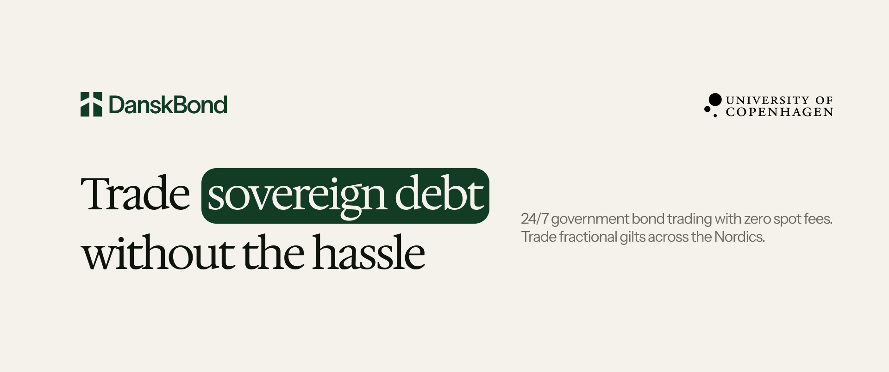

# DanskBond

*Trade sovereign debt without the hassle*

24/7 government bond trading with zero fees.
Trade fractional gilts across the Nordics.



---
## How to get it running


```shell
# Clone & Install
git clone https://github.com/afristrup/DanskBond.git
cd DanskBond
forge install

# Run Tests with Gas Benchmarks
forge test --gas-report

# Run Coverage Report
forge coverage
```


---

## Foundry (original README.md from Foundry)

**Foundry is a blazing fast, portable and modular toolkit for Ethereum application development written in Rust.**

Foundry consists of:

- **Forge**: Ethereum testing framework (like Truffle, Hardhat and DappTools).
- **Cast**: Swiss army knife for interacting with EVM smart contracts, sending transactions and getting chain data.
- **Anvil**: Local Ethereum node, akin to Ganache, Hardhat Network.
- **Chisel**: Fast, utilitarian, and verbose solidity REPL.


## Documentation

[https://book.getfoundry.sh/](https://book.getfoundry.sh/)

## Usage


### Build

```shell
$ forge build
```


### Test

```shell
$ forge test
```


### Format

```shell
$ forge fmt
```


### Gas Snapshots

```shell
$ forge snapshot
```


### Anvil

```shell
$ anvil
```


### Deploy

```shell
$ forge script script/Counter.s.sol:CounterScript --rpc-url <your_rpc_url> --private-key <your_private_key>
```


### Cast

```shell
$ cast <subcommand>
```


### Help

```shell
$ forge --help
$ anvil --help
$ cast --help
```

